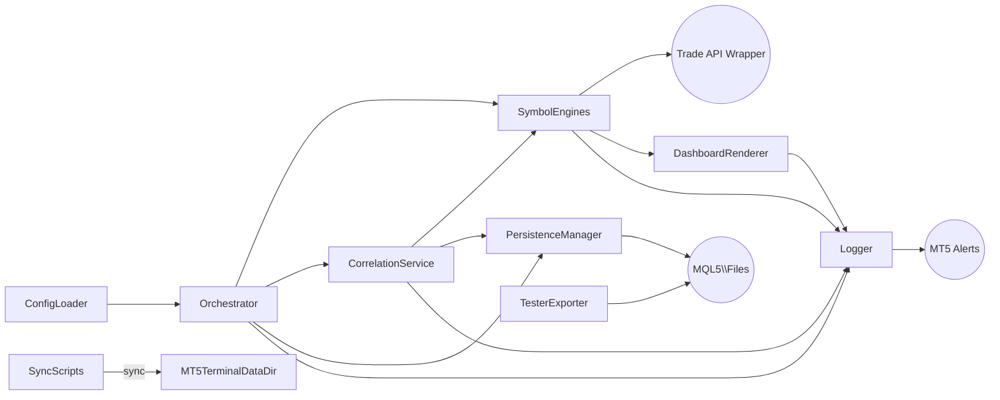
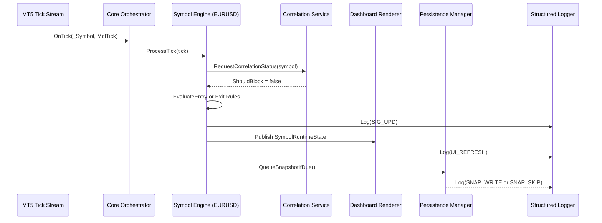
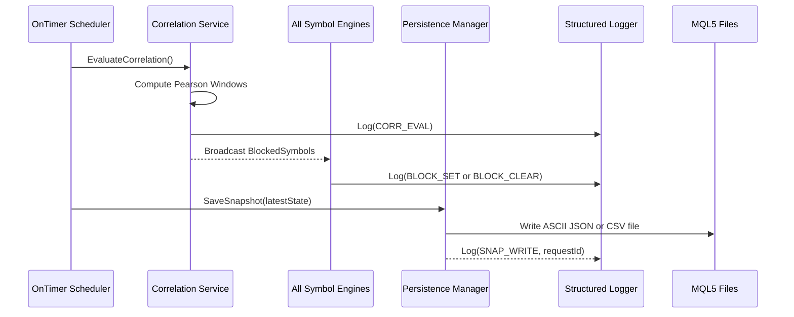
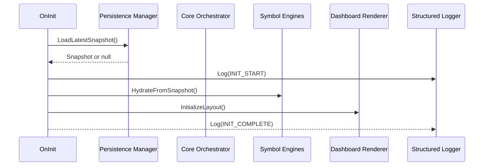
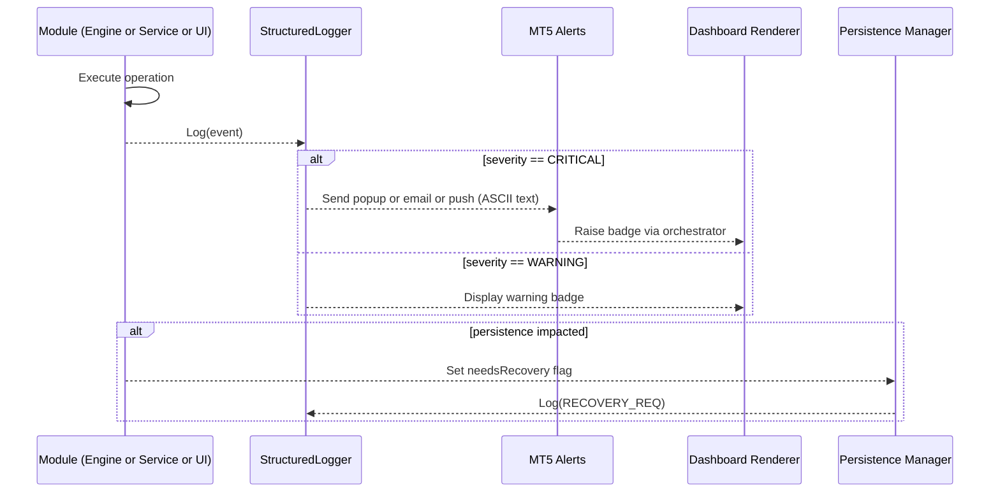

<!-- Auto-generated summary; edit shard files instead. -->
> NOTE: Edit the sharded files in docs/architecture-fullstack/ and regenerate this compiled view with md-tree assemble docs/architecture-fullstack docs/parchitecture-fullstackrd.md. Shard directory is the source of truth.

# fairPriceMP Fullstack Architecture Document

## Introduction
This document outlines the complete fullstack architecture for fairPriceMP, including backend systems, frontend implementation, and their integration. It serves as the single source of truth for AI-driven development, ensuring consistency across the entire technology stack.

This unified approach combines what would traditionally be separate backend and frontend architecture documents, streamlining the development process for modern fullstack applications where these concerns are increasingly intertwined.

### Starter Template or Existing Project
The multi-symbol EA builds on the existing single-symbol `fairPrice.mq5` codebase already present in this repository. We will refactor that proven trading logic into modular per-symbol engines, layer in correlation control, and add dashboard and persistence layers; no external starter templates are being imported. Key constraints: retain compatibility with MT5 strategy tester workflows, preserve the core grid/MA trade behaviour, and respect the existing user configuration surface while extending it for multi-symbol control.

### Change Log

| Date       | Version | Description                                  | Author  |
|------------|---------|----------------------------------------------|---------|
| 2025-10-02 | 0.1.0   | Initial fullstack architecture draft created | Winston |

## High Level Architecture

### Technical Summary
The system centers on a modular Expert Advisor running inside a Windows-based MT5 terminal, organized into independent per-symbol engines, a shared correlation service, and a dashboard renderer that share a common event bus. The frontend experience is the on-chart dashboard layer, built with structured drawing primitives and input bindings that surface state from the core trading modules; the backend is a set of MQL5 services that manage trade lifecycle, correlation monitoring, persistence, and logging. A lightweight orchestration layer coordinates configuration loading, task scheduling, and health reporting while background workers handle persistence snapshots and alert fan-out. All components execute in one MT5 process but are isolated via namespaces, consistent state DTOs, and test seams so the codebase remains maintainable even as we scale to 28 symbols. Supporting scripts (PowerShell for sync, CSV exporters) run alongside the EA to move artefacts into the MT5 `MQL5\\Experts`, `MQL5\\Indicators`, `MQL5\\Include`, and `MQL5\\Files` directories, satisfying the repository and terminal alignment the trader depends on. This structure meets the PRD goals by preserving proven fairPrice trade logic, adding correlation guardrails, guaranteeing restart resilience, and exposing deterministic telemetry for both live trading and strategy tester runs.
### Platform and Infrastructure Choice
**Option A � Windows VPS with MT5 Terminal (Recommended)**
- Pros: Always-on environment, stable network latency to broker, easy to back up MT5 data folders, simplifies automation of log exports.
- Cons: Monthly VPS cost, need to harden Windows security.
- Fit: Aligns with requirement to run 28 symbols concurrently and keep persistent state and logs.

**Option B � High-Spec Local Trading Workstation**
- Pros: Zero hosting cost, straightforward hardware control, quick manual intervention.
- Cons: Dependent on user uptime and internet, harder to automate backups across restarts.
- Fit: Acceptable for early tuning but risks downtime for production trading.

**Option C � Managed Prop-Firm Hosting (MT5 SaaS)**
- Pros: Broker-grade redundancy, managed OS patching.
- Cons: Limited filesystem access (difficult to manage Include or Files directories), vendor lock-in, reduced control over correlation snapshots.
- Fit: Conflicts with need for custom persistence and log handling.

**Recommendation**

**Platform:** Windows VPS (MT5 Terminal on Windows Server 2019/2022)  
**Key Services:** MT5 Terminal, MQL5 scheduler (OnTimer), PowerShell sync scripts, optional cloud storage for log backup  
**Deployment Host and Regions:** Primary VPS in broker-preferred region (for example London LD4) with secondary standby image for failover
### Repository Structure
```
**Structure:** Monorepo mirroring MT5 directory layout inside `src/MT5`
**Monorepo Tool:** Native Git (no extra tooling)
**Package Organization:**
- `src/MT5/Experts/fairPriceMP/` for EA modules
- `src/MT5/Include/fairPriceMP/` for shared headers and utilities
- `src/MT5/Indicators/` for custom indicators
- `src/MT5/Files/` for persistence snapshots and exported metrics
- `scripts/` for PowerShell or BAT sync helpers
```

### High Level Architecture Diagram
```mermaid
graph TD
    Trader[Trader UI Interaction] --> MT5Terminal[MT5 Terminal (Windows VPS)]
    MT5Terminal -->|loads| FairPriceEA[fairPriceMP EA (Experts/fairPriceMP)]
    FairPriceEA -->|publishes state| Dashboard[On-Chart Dashboard Renderer]
    FairPriceEA -->|dispatches| SymbolEngines[Per-Symbol Engines]
    SymbolEngines -->|trade ops| TradeOps[MQL5 Trade API]
    FairPriceEA --> CorrelationSvc[Correlation & Guardrail Service]
    FairPriceEA --> Persistence[State Persistence (Files/Global Vars)]
    FairPriceEA --> Logging[Structured Logging & Alerts]
    Persistence --> FilesDir[MT5 Files Directory (Snapshots/Exports)]
    Logging --> Alerts[MT5 Alerts (Popup/Email/Push)]
    scripts[Sync & Export Scripts] -->|sync artefacts| MT5Terminal
    StrategyTester[Strategy Tester] --> FairPriceEA
```

### Architectural Patterns
- **Modular Monolith EA:** Single MT5 process with explicit module boundaries and dependency inversion between orchestration, engines, correlation, and UI components. _Rationale:_ Matches MT5 execution constraints while keeping the codebase maintainable and testable.
- **Event-Driven Intra-EA Messaging:** Publish or subscribe dispatcher for state updates (ticks, correlation events, dashboard refresh). _Rationale:_ Decouples modules and avoids tight coupling when scaling to 28 symbols.
- **Repository and DTO Pattern for State:** Shared DTOs in `Include/fairPriceMP` with repository-style accessors for configuration, persistence, and telemetry. _Rationale:_ Ensures consistent state handling across modules and simplifies strategy tester determinism.
- **Scheduled Task Loop Pattern:** Central OnTimer scheduler triggers correlation recalculations, persistence snapshots, and dashboard updates. _Rationale:_ Provides predictable cadence from the PRD without blocking tick processing.
- **Layered Error Handling:** Standardized error facade wrapping MT5 return codes with uniform logging and dashboard error badges. _Rationale:_ Supports unified alerting and simplifies debugging across modules.
## Tech Stack

| Category                | Technology / Toolset                                      | Version           | Purpose                                                | Rationale                                                                                                   |
|-------------------------|-----------------------------------------------------------|-------------------|--------------------------------------------------------|-------------------------------------------------------------------------------------------------------------|
| Frontend Language       | MQL5 (strict)                                             | MT5 build >= 3900 | Render dashboard UI layers and handle EA events        | Native language for MT5 ensures deterministic execution and compatibility with broker-supported builds.    |
| Frontend Framework      | MT5 chart objects and events                              | Built-in          | Drive on-chart dashboard layout and interactions       | MT5 primitives deliver low-latency rendering without external dependencies and keep artefacts inside Experts. |
| UI Component Library    | Custom `DashboardRenderer` module (`Experts/fairPriceMP`) | v1                | Encapsulate table or grid drawing, badges, and tooltips| Purpose-built module keeps UI logic reusable and stored alongside EA assets for VPS sync.                   |
| State Management        | `SymbolStateRegistry` (in-memory plus global variables)   | v1                | Maintain per-symbol telemetry and config state         | Tailored registry balances tick-level latency with restart persistence needs.                              |
| Backend Language        | MQL5 (strict)                                             | MT5 build >= 3900 | Core trading logic, correlation engine, persistence    | Single-language stack simplifies modularization inside MT5 single-process constraint.                       |
| Backend Framework       | Native MQL5 services (`CTrade`, `OnTimer`, modules)       | Built-in          | Trade execution, scheduling, event handling            | Leveraging proven MT5 abstractions avoids reinventing infrastructure and keeps the EA portable.            |
| Data Storage            | MT5 `Files` directory (CSV or JSON snapshots)             | MT5 file API      | Persist run state, metrics, and backtest outputs       | Aligns with requirement to mirror MT5 folder names and ensures VPS sync scripts remain trivial.             |
| Caching Layer           | In-memory arrays plus MT5 global variables                | Built-in          | Cache indicator buffers, correlation windows, configs  | Provides fast access while allowing crash-safe recovery via global variables.                               |
| Authentication & Authz  | MT5 terminal account credentials                          | Broker managed    | Secure trading session with broker                     | No additional auth layer; relies on broker-secured login while keeping credentials out of the repository.  |
| API Approach            | In-process module interfaces                              | N/A               | Module-to-module contracts via DTOs and dispatcher     | Eliminates network overhead, matching single-terminal deployment and tester determinism requirements.       |
| Testing & QA Tools      | MT5 strategy tester (multi-currency), log diff scripts    | MT5 built-in plus PS | Regression, optimisation, deterministic log validation | Supports PRD requirement for multi-symbol backtests and repeatable metrics exports.                         |
| Build & Deployment      | MetaEditor or `mql.exe` compiler, PowerShell sync scripts | MT5 toolchain     | Compile EA, push artefacts into `MQL5\\Experts` and `Include` | Maintains folder parity with MT5 on the VPS and enables scripted deployments and backups.                   |
| Monitoring & Logging    | Terminal journal, custom structured log module            | MT5 plus custom   | Operational telemetry, alert routing, file exports     | Unified logging keeps audit trail accessible on VPS and via synced Files outputs for post-run analysis.     |
## Data Models

### SymbolConfigEntry
**Purpose:** Capture trader-defined global defaults and per-symbol overrides that drive engines, correlation caps, and dashboard presentation.

**Key Attributes:**
- `symbol`: `string` � MT5 symbol name; must match broker symbol exactly (ASCII only).
- `isEnabled`: `bool` � Whether the symbol participates in trading.
- `overrides`: `struct SymbolOverrides` � Optional per-symbol parameter deltas.
- `dashboardStyle`: `struct DashboardStyle` � Row-level colour or font overrides for readability.

```typescript
struct SymbolConfigEntry {
  string symbol;
  bool isEnabled;
  SymbolOverrides overrides;
  DashboardStyle dashboardStyle;
};
```

**Relationships:** Feed `SymbolRuntimeState` during init; shared with `CorrelationSnapshot` to determine concurrency caps.
### SymbolRuntimeState
**Purpose:** Hold live telemetry for each active symbol so engines, dashboard, and persistence remain in sync.
**Key Attributes:**
- `symbol`: `string` – Identifier linking to config entry.
- `signalState`: `ENUM_SIGNAL_STATE` – Current signal (Buy, Sell, Idle, Blocked).
- `openTrades`: `int` – Count of active trades tracked by MagicNumber.
- `drawdownPercent`: `double` – Peak-to-current equity drawdown for the symbol.
- `lastActionTime`: `datetime` – Timestamp of last trade or correlation block update.
- `correlationBlocked`: `bool` – Whether new entries are currently prevented.
```typescript
struct SymbolRuntimeState {
  string symbol;
  ENUM_SIGNAL_STATE signalState;
  int openTrades;
  double drawdownPercent;
  datetime lastActionTime;
  bool correlationBlocked;
};
```

**Relationships:** Updated by `SymbolEngine`, rendered by dashboard view models, serialized into `PersistenceSnapshot`.
### CorrelationSnapshot
**Purpose:** Persist outputs of the correlation service per evaluation cycle to enforce guardrails and provide audit trail.

**Key Attributes:**
- `evaluationTime`: `datetime` – When the correlations were computed.
- `pairwiseScores`: `struct PairwiseScore[]` – Symbol pairs with Pearson values.
- `blockedSymbols`: `string[]` – Symbols blocked this cycle due to exceeding cap.
- `capThreshold`: `int` – Global limit on concurrent correlated symbols.
```typescript
struct CorrelationSnapshot {
  datetime evaluationTime;
  PairwiseScore pairwiseScores[];
  string blockedSymbols[];
  int capThreshold;
};
```
**Relationships:** Consumed by `SymbolEngine` to decide entry eligibility, logged for diagnostics, stored in Files directory for backtest exports.
### StructuredLogEntry
**Purpose:** Standardize log output for live runs and tester replays so analysis scripts can diff behaviour deterministically.

**Key Attributes:**
- `timestamp`: `datetime` – UTC timestamp of the event.
- `module`: `ENUM_MODULE` – Originating module (Engine, Correlation, Dashboard, Persistence).
- `eventCode`: `string` – Short ASCII code describing the event.
- `message`: `string` – ASCII-only detail string.
- `metadata`: `struct KeyValue[]` – Optional key-value pairs.
```typescript
struct StructuredLogEntry {
  datetime timestamp;
  ENUM_MODULE module;
  string eventCode;
  string message;
  KeyValue metadata[];
};
```
**Relationships:** Emitted by all modules through the shared logging facade; basis for alert routing and tester log comparisons.
### PersistenceSnapshot
**Purpose:** Provide crash-safe restore point for engines and correlation state by writing to MT5 `Files` directory.

**Key Attributes:**
- `snapshotId`: `string` – Sequential or timestamp-based identifier (ASCII).
- `capturedAt`: `datetime` – When snapshot was taken.
- `runtimeStates`: `SymbolRuntimeState[]` – Serialized runtime state array.
- `pendingOrders`: `struct PendingOrderRecord[]` – Info on grid orders queued but not filled.
- `correlation`: `CorrelationSnapshot` – Latest correlation data.
```typescript
struct PersistenceSnapshot {
  string snapshotId;
  datetime capturedAt;
  SymbolRuntimeState runtimeStates[];
  PendingOrderRecord pendingOrders[];
  CorrelationSnapshot correlation;
};
```
**Relationships:** Written by persistence worker on schedule, read during EA init to resume state, exported post-backtest for optimisation analysis.
## API Specification
The EA runs entirely inside MT5 with no HTTP, GraphQL, or tRPC interface; all communication occurs through in-process module contracts defined in the components section. Therefore no external API specification is required beyond those interfaces.
## Components

### Orchestrator Core
**Responsibility:** Bootstraps the EA, loads configuration from `Include/fairPriceMP/config`, owns event loop (`OnInit`, `OnTick`, `OnTimer`), and coordinates handoffs between modules.

**Key Interfaces:**
- `bool InitSystem(string configPath)`
- `void DispatchTick(string symbol, MqlTick tick)`
- `void ScheduleTask(ENUM_TASK taskId, int delayMs)`

**Dependencies:** Configuration loader, symbol engines, correlation service, persistence manager, logging facade.

**Technology Stack:** MQL5 class in `Experts/fairPriceMP/CoreOrchestrator.mqh` leveraging MT5 built-ins.
### Configuration Loader
**Responsibility:** Parse global defaults and per-symbol overrides, validate ASCII-only values, surface DTOs to other modules.

**Key Interfaces:**
- `ConfigDto LoadConfig(string fileName)`
- `ValidationResult ValidateSymbolList(string symbols[])`

**Dependencies:** Files directory access, logging facade.

**Technology Stack:** Utility in `Include/fairPriceMP/ConfigLoader.mqh` using MT5 file API and ASCII validator.
### Symbol Engine
**Responsibility:** Execute fairPrice trade lifecycle (signal evaluation, grid placement, equity stop) independently per symbol.

**Key Interfaces:**
- `void ProcessTick(MqlTick tick)`
- `void ApplyCorrelationBlock(bool blocked)`
- `SymbolRuntimeState GetRuntimeState()`

**Dependencies:** Configuration DTOs, correlation service, trade execution proxy, logging facade, persistence manager.

**Technology Stack:** Class in `Experts/fairPriceMP/Engines/SymbolEngine.mqh`.
### Correlation Service
**Responsibility:** Maintain rolling correlation windows, compute Pearson coefficients, enforce concurrency caps, publish block or unblock events.

**Key Interfaces:**
- `CorrelationSnapshot EvaluateCorrelation(map<string, double[]> ticksBySymbol)`
- `bool ShouldBlock(string symbol)`

**Dependencies:** Configuration, orchestrator scheduler, logging, persistence.

**Technology Stack:** `Experts/fairPriceMP/Services/CorrelationService.mqh` with math helpers in `Include`.
### Dashboard Renderer
**Responsibility:** Draw on-chart table, warnings, and summary strip; respond to user inputs; ensure ASCII-safe labels.

**Key Interfaces:**
- `void Render(const SymbolRuntimeState states[], const CorrelationSnapshot &corr)`
- `void HighlightAlert(string symbol, string code)`

**Dependencies:** Symbol engine data, configuration for styles, logging for UI actions.

**Technology Stack:** `Experts/fairPriceMP/UI/DashboardRenderer.mqh` using MT5 drawing primitives.
### Persistence Manager
**Responsibility:** Serialize runtime state and snapshots to `Files/fairPriceMP`, load them on init, manage versioning.

**Key Interfaces:**
- `bool SaveSnapshot(const PersistenceSnapshot &state)`
- `bool LoadLatestSnapshot(PersistenceSnapshot &outState)`

**Dependencies:** Symbol engines, correlation service, logging, file IO guardrails.

**Technology Stack:** `Experts/fairPriceMP/Persistence/PersistenceManager.mqh` writing ASCII JSON or CSV.
### Logging and Alert Facade
**Responsibility:** Standardize log entries, wrap MT5 journal output, optional alert broadcasting, enforce ASCII-only text.

**Key Interfaces:**
- `void Log(const StructuredLogEntry &entry)`
- `void Alert(string eventCode, string message)`

**Dependencies:** All modules; optional PowerShell export scripts.

**Technology Stack:** `Include/fairPriceMP/Logging/StructuredLogger.mqh`.
### Strategy Tester Exporter
**Responsibility:** At tester completion, export metrics and logs to CSV or JSON for diffing and optimisation analysis.

**Key Interfaces:**
- `bool ExportMetrics(const PersistenceSnapshot &snapshot, string outputPath)`

**Dependencies:** Persistence manager, logging.

**Technology Stack:** `Experts/fairPriceMP/Export/TesterExporter.mqh`.
### Deployment Sync Scripts
**Responsibility:** Mirror repository artefacts into MT5 VPS directories (`MQL5\\Experts`, `Include`, `Files`).

**Key Interfaces:** PowerShell script parameters (source path, terminal data path).

**Dependencies:** Local filesystem, optional scheduling.

**Technology Stack:** `scripts/MT5_File_Sync.ps1`, `Start_MT5_Sync.bat`.

## External APIs
The MVP operates fully within MT5 using broker-provided market data; no third-party APIs are required. All integrations leverage native MT5 symbols and terminal services.
## Core Workflows



## Database Schema
We do not use a traditional database; persistence relies on MT5 `Files` directory with ASCII-encoded JSON or CSV artefacts. The snapshot format below is the contract developers must follow.
```json
{
  "snapshotId": "20251002T201500Z",
  "capturedAt": "2025-10-02T20:15:00Z",
  "runtimeStates": [
    {
      "symbol": "EURUSD",
      "signalState": "BUY",
      "openTrades": 2,
      "drawdownPercent": 0.45,
      "lastActionTime": "2025-10-02T20:14:37Z",
      "correlationBlocked": false
    }
  ],
  "pendingOrders": [
    {
      "symbol": "EURUSD",
      "ticket": 12345678,
      "type": "BUY_LIMIT",
      "price": 1.06750,
      "volume": 0.01,
      "expiry": "2025-10-03T00:00:00Z"
    }
  ],
  "correlation": {
    "evaluationTime": "2025-10-02T20:14:30Z",
    "capThreshold": 3,
    "blockedSymbols": ["GBPNZD"],
    "pairwiseScores": [
      { "symbolA": "EURUSD", "symbolB": "GBPUSD", "pearson": 0.68 }
    ]
  }
}
```
**Indexes and Constraints**
- File naming: `fairPriceMP_snapshot_YYYYMMDD_HHMMSS.json` (ASCII only).
- Write location: `%AppData%\MetaQuotes\Terminal\<GUID>\MQL5\Files\fairPriceMP\snapshots`.
- Max file size: rotate once snapshots exceed 50 MB to avoid tester slowdowns.
## Frontend Architecture

### Component Organization
```
Experts/fairPriceMP/UI/
  DashboardRenderer.mqh
  DashboardTable.mqh
  DashboardBadges.mqh
  InputHandler.mqh
  ThemeProfiles.mqh
Include/fairPriceMP/UI/
  ViewModels.mqh
  DrawPrimitives.mqh
  AsciiValidator.mqh
```

### Component Template
```typescript
void RenderDashboardRow(const DashboardRowViewModel &row, const int index)
{
  string rowId = "fp_row_" + IntegerToString(index);
  DrawLabel(rowId + "_symbol", row.symbol, row.position, ThemeProfiles::GetFont(row.themeId));
  DrawBadge(rowId + "_status", FormatStatus(row.signalState), row.badgeColor);
  DrawMetric(rowId + "_exposure", DoubleToString(row.exposureLots, 2));
  DrawMetric(rowId + "_dd", DoubleToString(row.drawdownPercent, 2) + "%");
  DrawBadge(rowId + "_corr", row.correlationBadgeText, row.correlationBadgeColor);
}
```

### State Structure
```typescript
struct DashboardRowViewModel
{
  string symbol;
  ENUM_SIGNAL_STATE signalState;
  double exposureLots;
  double drawdownPercent;
  bool correlationBlocked;
  string correlationBadgeText;
  color badgeColor;
  color correlationBadgeColor;
  DashboardRowPosition position;
  int themeId;
};
```

### State Management Patterns
- Per-symbol state pulled from `SymbolRuntimeState` each redraw; no caching beyond the current tick.
- Summary strip recalculated every refresh cycle using aggregated runtime states.
- All strings pass through `AsciiValidator::Sanitize` before drawing to prevent Unicode artefacts.
- Input events push commands back to orchestrator via queue to avoid UI modules mutating engines directly.

### Routing Architecture
```
OnChartEvent
  -> InputHandler::HandleClick()
     -> CommandQueue::Enqueue(command)
  -> InputHandler::HandleHotKey()
     -> CommandQueue::Enqueue(command)
DashboardRenderer::Refresh()
  -> Iterates view models and draws components sequentially
```
## Backend Architecture

### Service Architecture
```
Experts/fairPriceMP/
  CoreOrchestrator.mqh
  Engines/
    SymbolEngine.mqh
    SymbolEngineFactory.mqh
  Services/
    CorrelationService.mqh
    Scheduler.mqh
    TradeProxy.mqh
  Persistence/
    PersistenceManager.mqh
    SnapshotSerializer.mqh
  Export/
    TesterExporter.mqh
Include/fairPriceMP/
  DTO/
    ConfigDto.mqh
    SymbolRuntimeState.mqh
    CorrelationSnapshot.mqh
  Logging/
    StructuredLogger.mqh
    LogFormatter.mqh
  Validation/
    AsciiGuard.mqh
    ConfigValidator.mqh
```

### Controller Template
```typescript
void OnTick()
{
  MqlTick tick;
  if(!SymbolInfoTick(_Symbol, tick))
  {
    logger.LogError("TICK_FETCH", "Failed to read tick for " + _Symbol);
    return;
  }

  SymbolEngine *engine = engineRegistry.Get(_Symbol);
  if(engine == NULL)
  {
    logger.LogError("ENGINE_MISSING", "No engine registered for " + _Symbol);
    return;
  }

  engine.ProcessTick(tick);
}
```
### Data Access Layer Template
```typescript
class SnapshotRepository
{
private:
  string basePath;

public:
  SnapshotRepository(const string _basePath)
  {
    basePath = _basePath;
  }

  bool Save(const PersistenceSnapshot &snapshot)
  {
    string path = basePath + "\\" + snapshot.snapshotId + ".json";
    string payload = SnapshotSerializer::ToJson(snapshot);
    AsciiGuard::EnsureAscii(payload);
    return FileSystem::WriteFile(path, payload);
  }

  bool LoadLatest(PersistenceSnapshot &outSnapshot)
  {
    string latestPath = FileSystem::FindLatest(basePath);
    if(latestPath == "")
      return false;

    string payload = FileSystem::ReadFile(latestPath);
    AsciiGuard::EnsureAscii(payload);
    return SnapshotSerializer::FromJson(payload, outSnapshot);
  }
};
```

### Authentication and Authorization
MT5 terminals authenticate via broker credentials; the EA runs under the logged-in account. No additional authentication layers exist or are needed for the MVP.
## Unified Project Structure
```
fairPriceMP/
  docs/
    prd.md
    front-end-spec.md
    architecture-fullstack.md
  scripts/
    MT5_File_Sync.ps1
    Start_MT5_Sync.bat
  src/
    MT5/
      Experts/
        fairPriceMP/
          CoreOrchestrator.mq5
          Modules/
            Engines/
            Services/
            Persistence/
            Export/
          UI/
            DashboardRenderer.mqh
            DashboardTable.mqh
      Include/
        fairPriceMP/
          DTO/
          Logging/
          Validation/
          UI/
      Files/
        fairPriceMP/
          snapshots/
          logs/
      Indicators/
        fairPriceMP/
```
## Development Workflow

### Local Development Setup
**Prerequisites**
```bash
# Install Git for Windows
choco install git

# Install MetaTrader 5 terminal (broker distribution)
# Ensure MetaEditor or mql.exe accessible via PATH or known location

# Optional: install VS Code plus MQL5 syntax extension for editing
```

**Initial Setup**
```bash
# Clone repo
git clone https://<repo>/fairPriceMP.git
cd fairPriceMP

# Configure MT5 data path (replace GUID with your terminal ID)
setx MT5_DATA_PATH "%APPDATA%\MetaQuotes\Terminal\<GUID>"

# Optional: set up PowerShell execution policy for sync scripts
powershell -ExecutionPolicy Bypass -File .\scripts\Start_MT5_Sync.bat
```

**Development Commands**
```bash
# Compile EA from MetaEditor or command line
"C:\Program Files\MetaTrader 5\metaeditor64.exe" /compile:src\MT5\Experts\fairPriceMP\CoreOrchestrator.mq5

# Run unit harness (if added)
powershell -File scripts\Run_Local_Tests.ps1

# Launch MT5 tester with latest EX5
"C:\Program Files\MetaTrader 5\terminal64.exe" /portable
```

### Environment Configuration
```bash
MT5_DATA_PATH=%APPDATA%\MetaQuotes\Terminal\<GUID>
FAIRPRICE_SNAPSHOT_DIR=%MT5_DATA_PATH%\MQL5\Files\fairPriceMP\snapshots
FAIRPRICE_LOG_DIR=%MT5_DATA_PATH%\MQL5\Files\fairPriceMP\logs
```
## Deployment Architecture
**Frontend Deployment**
- Platform: MT5 terminal (Windows VPS)
- Build Command: `metaeditor64.exe /compile:src\MT5\Experts\fairPriceMP\CoreOrchestrator.mq5`
- Output Directory: `%MT5_DATA_PATH%\MQL5\Experts\fairPriceMP\CoreOrchestrator.ex5`
- CDN or Edge: N/A

**Backend Deployment**
- Platform: same MT5 terminal
- Build Command: same compile step (single artefact)
- Deployment Method: `scripts\MT5_File_Sync.ps1` copies `src\MT5\Experts`, `Include`, and `Files` into terminal folders (ASCII filenames only)

**CI or CD Pipeline (optional skeleton)**
```yaml
name: build-fairPriceMP
on: [push]
jobs:
  compile:
    runs-on: windows-latest
    steps:
      - uses: actions/checkout@v3
      - name: Install MetaEditor
        run: choco install metatrader5 --no-progress
      - name: Compile EA
        run: metaeditor64.exe /compile:src\MT5\Experts\fairPriceMP\CoreOrchestrator.mq5 /log:build.log
      - name: Archive Artefacts
        uses: actions/upload-artifact@v3
        with:
          name: fairPriceMP-ex5
          path: |
            src\MT5\Experts\fairPriceMP\CoreOrchestrator.ex5
            build.log
```

**Environments**

| Environment | Frontend URL | Backend URL | Purpose |
|-------------|--------------|-------------|---------|
| Development | N/A          | N/A         | Local development and tester runs |
| Staging     | N/A          | N/A         | Optional secondary VPS clone for soak tests |
| Production  | N/A          | N/A         | Live VPS terminal trading |
### Maintenance & Rollback Runbook
- **Cadence:** Apply OS and MT5 terminal updates on the first Sunday of each month, or sooner if a security bulletin is issued.
- **Ownership:** Trading operations lead (or delegate) coordinates the window, with the developer on-call to validate EA health.

**Pre-maintenance Checklist**
1. Schedule a 2-hour maintenance window outside active trading sessions and notify stakeholders.
2. Stop live trading and export the latest snapshots/logs to off-box storage (%FAIRPRICE_SNAPSHOT_DIR% and %FAIRPRICE_LOG_DIR%).
3. Clone the VPS (cloud snapshot or Hyper-V checkpoint) and copy the current CoreOrchestrator.ex5, configuration files, and PowerShell sync scripts.
4. Confirm strategy tester baseline run passes on the backup build so rollback artefacts are trusted.

**Patch & Verification Steps**
1. Apply Windows updates, reboot, and confirm system time/locale remain unchanged.
2. Launch MT5 and allow terminal updates; decline optional beta builds.
3. Recompile the EA (metaeditor64.exe /compile:src\MT5\Experts\fairPriceMP\CoreOrchestrator.mq5) and run a smoke backtest.
4. Execute the sync script to ensure the updated EX5, Include files, and persistence folders are in sync.
5. Start live terminal, enable the EA on the sandbox account, and monitor logs for 15 minutes (tick processing, correlation, snapshots).

**Rollback Plan**
1. If validation fails, disable trading immediately and restore the VPS snapshot taken before maintenance.
2. Reapply the backed-up EX5 and configuration via the sync script, then verify the EA loads without warnings.
3. Review structured logs to confirm correlation service and snapshot writer resume cleanly.
4. Document the incident, root cause, and follow-up actions before scheduling a new maintenance window.


## Security and Performance
**Frontend Security**
- CSP Headers: N/A (MT5 chart)
- XSS Prevention: Limit inputs to ASCII; sanitize text before drawing.
- Secure Storage: No sensitive data stored in UI; only derived telemetry.

**Backend Security**
- Input Validation: Config loader rejects unsupported symbols, Unicode, or invalid numeric ranges.
- Rate Limiting: Guard correlation recalculation frequency via scheduler.
- CORS Policy: N/A.

**Authentication Security**
- Token Storage: Not applicable; rely on broker login.
- Session Management: MT5 terminal session.
- Password Policy: Managed by broker; do not log or persist credentials.

**Performance Optimization**
- Frontend: Limit chart objects per refresh to fewer than 400; reuse object IDs to avoid flicker; throttle redraw to 1 Hz.
- Backend: Target tick processing under 10 ms; cache MA buffers; stagger correlation evaluations; rotate snapshot files to avoid I/O spikes.
## Testing Strategy
```
E2E Tests
/        \
Integration Tests
/            \
Frontend Unit  Backend Unit
```

**Frontend Tests**
```
- Snapshot comparison of dashboard rows via view model harness
- Rendering smoke test asserting chart object counts and ASCII validation success
```

**Backend Tests**
```
- SymbolEngine deterministic replay using recorded tick streams
- CorrelationService window maths validated against reference CSV
- Persistence round-trip: serialize, deserialize, compare DTOs
```

**E2E Tests**
```
- MT5 strategy tester multi-symbol runs with assertion script diffing exported logs
- VPS smoke test: compile, sync, start terminal, verify snapshot and log directories populated
```

**Test Example**
```typescript
void TestCorrelationBlocksWhenAboveCap()
{
  CorrelationService svc(...);
  svc.LoadHistory(mockData);
  CorrelationSnapshot snap = svc.Evaluate();
  assert(snap.blockedSymbols[0] == "GBPUSD");
}
```
## Monitoring and Observability
- Frontend Monitoring: Structured logger events (`UI_REFRESH`, `ALERT_TAP`), optional screenshot script on critical alerts.
- Backend Monitoring: Structured logs per module, heartbeat entry every 60 seconds, scheduler duration metrics.
- Error Tracking: MT5 alerts (popup, email, push) plus log flag `severity=CRITICAL` for downstream filters.
- Performance Monitoring: Snapshot exports capturing tick latency, correlation duration, snapshot write time; PowerShell summarizer emails daily stats.

**Key Metrics**
- Frontend: dashboard redraw latency, object count, warning badge count, operator acknowledgement time for critical alerts.
- Backend: average tick processing time, correlation evaluation duration and blocked symbol count, snapshot success rate, strategy tester runtime vs baseline.
## Coding Standards
- **ASCII-Only Everything:** All strings, filenames, comments, and logs must be plain ASCII; reject or sanitize any Unicode.
- **Use Shared DTOs:** Only use structs in `Include/fairPriceMP/DTO` for state or config exchange.
- **Wrap MT5 API Calls:** Always use provided wrappers (`TradeProxy`, `DrawPrimitives`, `StructuredLogger`) instead of raw APIs.
- **Normalize Values Explicitly:** Normalize every price or lot with `_Digits` or `_Point` before trade submission.
- **Check Return Codes:** Capture `GetLastError()` or result retcodes and log via `StructuredLogger` on failure.
- **Schedule Safely:** Route time-based work through the shared scheduler; no ad-hoc `Sleep` loops or direct timer calls.
- **Config Validation First:** Call and validate `LoadConfig` before any engine starts; halt init on validation failure.
- **Snapshots Are Canonical:** Use `PersistenceManager` for all persistence; do not write arbitrary files or alter schemas without updating docs and tests.

| Element           | Frontend (Dashboard/UI) | Backend (Engines/Services) | Example                      |
|-------------------|-------------------------|-----------------------------|------------------------------|
| Modules/Files     | PascalCase              | PascalCase                  | `DashboardRenderer.mqh`      |
| Functions         | camelCase               | camelCase                   | `renderDashboard()`          |
| Structs/DTOs      | PascalCase              | PascalCase                  | `SymbolRuntimeState`         |
| Constants/Enums   | UPPER_SNAKE_CASE        | UPPER_SNAKE_CASE            | `MAX_SYMBOLS`, `ENUM_MODULE` |
| Global Variables  | g_PrefixCamelCase       | g_PrefixCamelCase           | `g_Config`, `g_SnapshotPath` |
| Logger Event Codes| UPPER_SNAKE (<=10 chars)| UPPER_SNAKE (<=10 chars)    | `SIG_UPD`, `CORR_FAIL`       |
## Error Handling Strategy

### Error Flow


### Error Response Format
```typescript
struct StructuredError
{
  string code;
  string message;
  long timestamp;
  string requestId;
  string module;
  string severity;
};
```

### Frontend Error Handling
```typescript
void DashboardRenderer::RenderErrorBadge(const StructuredError &err)
{
  string badgeId = "fp_error_" + err.code;
  color col = (err.severity == "CRITICAL") ? clrRed : clrOrange;
  DrawBadge(badgeId, "[" + err.code + "] " + err.message, col);
}
```

### Backend Error Handling
```typescript
bool SymbolEngine::PlaceOrder(const TradeRequest &req)
{
  bool ok = tradeProxy.Execute(req, lastError);
  if(!ok)
  {
    StructuredError err;
    err.code = "TRADE_FAIL";
    err.message = "OrderSend failed (" + IntegerToString(lastError) + ")";
    err.timestamp = TimeCurrent();
    err.module = this.symbol;
    err.severity = "CRITICAL";
    logger.Log(err);
    return false;
  }
  return true;
}
```

## Checklist Results Report
### architect-checklist (2025-10-02)
- Execution mode: Comprehensive (all-at-once)
- Overall assessment: **Ready with minor follow-ups**

| Section | Pass Rate | Status | Notes |
|---------|-----------|--------|-------|
| 1. Requirements Alignment | 100% | PASS | Architecture maps cleanly to PRD epics, including correlation guardrails, tester support, and dashboard expectations. |
| 2. Architecture Fundamentals | 100% | PASS | Component responsibilities, diagrams, and data flows are explicitly documented for the MT5 modular monolith. |
| 3. Modularity & Maintainability | 100% | PASS | Shared DTOs, wrapper layers, and clear module folders keep concerns separated and change-friendly. |
| 4. Data Management & Persistence | 100% | PASS | Snapshot schema, rotation guidance, and ASCII-safety requirements cover persistence and data hygiene. |
| 5. Security, Reliability & Monitoring | 90% | PASS | Operational logging and alerting are defined; document clarifies security posture, though VPS hardening tasks should be tracked separately. |
| 6. Scalability & Performance | 90% | PASS | Tick latency targets and scheduling strategy are outlined; profiling plan for 28-symbol load should be confirmed during implementation. |
| 7. Implementation Readiness & Tooling | 100% | PASS | Coding standards, testing stack, workflow, and deployment scripts provide clear developer guidance. |
| 8. Dependency & Integration Management | 80% | PARTIAL | External dependency list is short but fallback/update strategy for MT5 releases and Windows patches needs explicit ownership. |
| 9. AI Agent Implementation Suitability | 100% | PASS | Uniform naming, DTO reuse, and command queue patterns tailor the codebase for AI agent execution. |
| 10. Accessibility (Frontend Only) | N/A | N/A | MT5 on-chart UI does not support web accessibility tooling; documented as out-of-scope for this environment. |

**Key Risks & Follow-ups**
1. Correlation workload under 28-symbol stress needs profiling to confirm CPU headroom on target VPS class.
2. Single-terminal dependency: document contingency for terminal restarts/updates (schedule maintenance windows & backup plan).
3. MT5/Windows update policy unspecified�assign owner for patch cadence and rollback steps.
4. Snapshot rotation threshold (50 MB) may still grow quickly during heavy tester usage; define archival or purge automation.
5. Alert fatigue risk if structured logger fires too many CRITICAL events; recommend severity tuning during beta.

**Recommendations**
- **Must address:** Formalize MT5/Windows update & rollback SOP; add to deployment workflow.
- **Should address:** Add profiling task for correlation scheduler under max pair load; document expected CPU/memory budget.
- **Nice to have:** Provide sample PowerShell script for snapshot archival and log pruning to keep Files directory tidy.

The architecture is ready for development handoff once the dependency management notes above are captured in the runbook.
