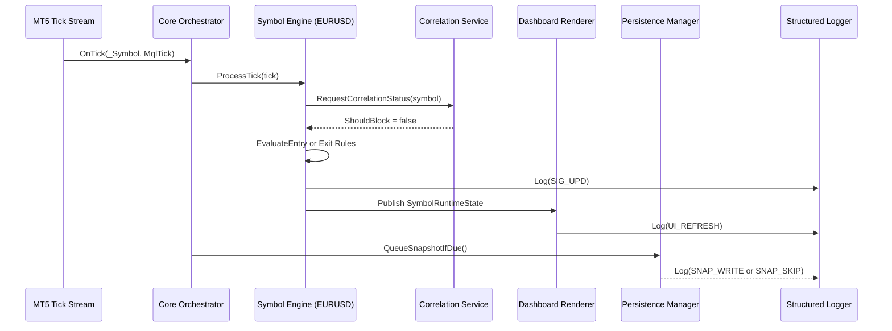
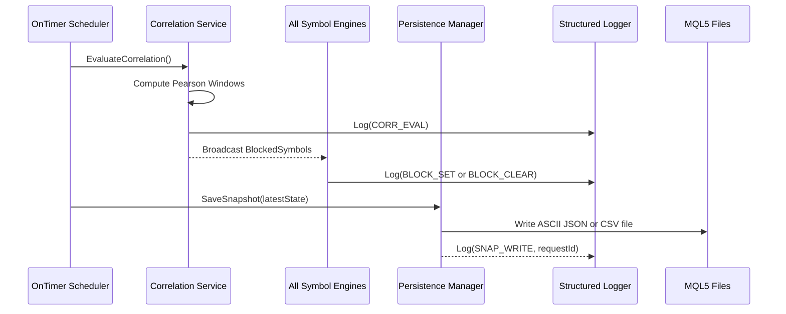

# Core Workflows


```mermaid
sequenceDiagram
    participant Init as OnInit
    participant Persist as Persistence Manager
    participant Orchestrator as Core Orchestrator
    participant Engines as Symbol Engines
    participant Dash as Dashboard Renderer
    participant Logger as Structured Logger
    Init->>Persist: LoadLatestSnapshot()
    Persist-->>Init: Snapshot or null
    Init->>Logger: Log(INIT_START)
    Init->>Engines: HydrateFromSnapshot()
    Init->>Dash: InitializeLayout()
    Init-->>Logger: Log(INIT_COMPLETE)
```
