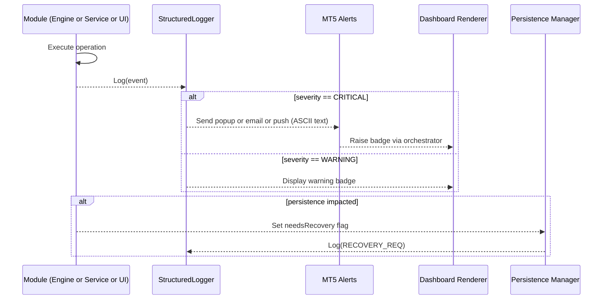

# Error Handling Strategy

### Error Flow


### Error Response Format
```typescript
struct StructuredError
{
  string code;
  string message;
  long timestamp;
  string requestId;
  string module;
  string severity;
};
```

### Frontend Error Handling
```typescript
void DashboardRenderer::RenderErrorBadge(const StructuredError &err)
{
  string badgeId = "fp_error_" + err.code;
  color col = (err.severity == "CRITICAL") ? clrRed : clrOrange;
  DrawBadge(badgeId, "[" + err.code + "] " + err.message, col);
}
```

### Backend Error Handling
```typescript
bool SymbolEngine::PlaceOrder(const TradeRequest &req)
{
  bool ok = tradeProxy.Execute(req, lastError);
  if(!ok)
  {
    StructuredError err;
    err.code = "TRADE_FAIL";
    err.message = "OrderSend failed (" + IntegerToString(lastError) + ")";
    err.timestamp = TimeCurrent();
    err.module = this.symbol;
    err.severity = "CRITICAL";
    logger.Log(err);
    return false;
  }
  return true;
}
```

